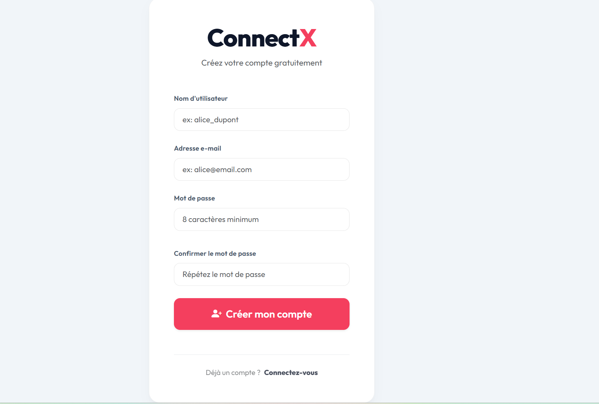

# Rapport de Projet : ConnectX
**Plateforme Sociale Avancée avec Interactions Temps Réel**

---

## Informations Générales
*   **Auteur** : [Votre Nom]
*   **Formation** : M1 IA & BIG DATA
*   **Projet** : Réseau social avancé (Groupe J)
*   **Technologies** : Django, Docker, Redis, PostgreSQL, WebSockets
*   **Date** : Avril 2026

---

## 1. Résumé
ConnectX est un réseau social complet développé avec le framework Django. L'objectif principal était de concevoir une plateforme capable de gérer des flux de données asynchrones et des interactions en temps réel. Le projet intègre un système d'authentification personnalisé, un fil d'actualité dynamique, une messagerie instantanée basée sur les WebSockets, et un système de notifications. L'application est conteneurisée avec Docker et déployée sur une infrastructure Cloud (Hetzner) via Coolify, garantissant ainsi une scalabilité et une portabilité optimales.

---

## 2. Introduction
### 2.1 Contexte
Dans l'ère du Web social, l'instantanéité est devenue une norme. Les utilisateurs s'attendent à recevoir des messages et des notifications sans rafraîchir leur navigateur. ConnectX répond à cette problématique en utilisant des technologies modernes comme Django Channels et Redis.

### 2.2 Problématique
Comment construire une architecture robuste capable de lier des milliers d'utilisateurs, de gérer des relations asymétriques (abonnements) et de maintenir des connexions persistantes pour le chat, le tout dans un environnement sécurisé et performant ?

---

## 3. Cahier des Charges
### 3.1 Besoins Fonctionnels
*   **Authentification** : Inscription et connexion via email.
*   **Profils** : Personnalisation avec avatar et bannière.
*   **Social** : Système de suivi (Follow/Unfollow) et suggestions d'amis.
*   **Publications** : Partage de textes et d'images.
*   **Messagerie** : Chat en temps réel avec indicateurs de lecture.
*   **Notifications** : Alertes instantanées pour les interactions.

### 3.2 Captures de l'Interface
#### Connexion et Inscription
L'interface de connexion est épurée, mettant en avant la sécurité et la simplicité.


*Figure 1 : Formulaire de connexion sécurisé.*


*Figure 2 : Formulaire d'inscription avec validation en temps réel.*

---

## 4. Architecture des Données (Détails Techniques)

L'un des points forts de ConnectX réside dans sa modélisation relationnelle. Nous avons fait le choix d'utiliser **PostgreSQL** pour sa robustesse et sa gestion native des types de données complexes.

### 4.1 Analyse détaillée des Modèles

#### A. Le module `accounts`
Nous avons implémenté un `CustomUser` pour nous affranchir des limitations du modèle `User` natif de Django.
*   **EmailField (Unique=True)** : L'email sert d'identifiant unique à la place du username traditionnel, alignant l'application sur les standards UX modernes.
*   **Public_id (UUID)** : Pour la sécurité, nous utilisons des UUID pour les URLs publiques au lieu des IDs numériques (PK), empêchant ainsi l'énumération des utilisateurs.
*   **Modèle Profile** : Lié par une `OneToOneField` à l'utilisateur, il stocke les données "non-essentielles" (bio, avatar, banner). Cela optimise les performances en évitant de charger des données lourdes lors de simples vérifications d'authentification.

#### B. Le module `posts`
La gestion des publications doit être capable de supporter des milliers d'entrées.
*   **Modèle Post** : Contient le texte et les métadonnées (création, modification).
*   **Modèle PostImage** : Une relation `ForeignKey` vers `Post`. Ce choix permet d'attacher plusieurs images à une seule publication, offrant une flexibilité supérieure à un simple champ ImageField unique.
*   **Modèle Like** : Utilise une contrainte `unique_together` entre l'utilisateur et le post. 
    *   *Justification* : Cette contrainte au niveau de la base de données (SQL) garantit qu'un utilisateur ne peut pas liker deux fois le même contenu, même en cas de requêtes concurrentes rapides.

#### C. Le module `social`
Le système d'abonnements repose sur une table de liaison `Follow`.
*   **Self-referential Many-to-Many** : Un utilisateur suit d'autres utilisateurs. 
*   **Logique de flux** : Pour générer le fil d'actualité, nous utilisons une requête optimisée :
    `Post.objects.filter(author__follower_relations__follower=user)`
    Cette requête permet de récupérer instantanément toutes les publications des comptes suivis.

---

## 5. La Couche Temps Réel (Django Channels & Redis)

### 5.1 Protocole WebSocket vs HTTP
Le protocole HTTP est par nature sans état (stateless) et unidirectionnel. Pour une messagerie, le "Polling" (le client demande toutes les 5 secondes s'il y a des nouveaux messages) est inefficace et sature le serveur.

**Solution ConnectX** : Nous utilisons les WebSockets (`ws://`). 
1.  Le client établit une connexion persistante avec le serveur **Daphne**.
2.  Le serveur enregistre l'utilisateur dans un "Group" (ex: `chat_room_12`).
3.  Lorsqu'un message est envoyé, il est publié dans **Redis**.
4.  Redis redistribue le message à tous les membres du groupe connectés.

### 5.2 Implémentation du Consumer
Le `Consumer` est le cœur asynchrone du système. Contrairement aux vues Django classiques, il utilise la syntaxe `async/await` de Python pour ne pas bloquer le thread principal lors des opérations d'E/S (Entrées/Sorties).

---

## 6. Sécurité et Protection des Données

La sécurité a été une priorité absolue durant toute la phase de développement.

### 6.1 Protection contre les vulnérabilités majeures
*   **Cross-Site Request Forgery (CSRF)** : Django génère un jeton unique pour chaque session utilisateur. Sans ce jeton, aucune requête de type POST (inscription, message, like) ne peut être exécutée. En production, nous avons dû configurer `CSRF_TRUSTED_ORIGINS` pour autoriser notre domaine HTTPS.
*   **Injections SQL** : Grâce à l'ORM de Django, aucune requête SQL n'est écrite "en dur". L'ORM utilise des requêtes paramétrées qui neutralisent toute tentative d'injection.
*   **Cross-Site Scripting (XSS)** : Le moteur de template de Django échappe automatiquement les caractères spéciaux HTML. Si un utilisateur tente d'injecter du JavaScript dans une publication, celui-ci sera affiché comme du texte brut et non exécuté.

### 6.2 Gestion des secrets (DevOps)
Aucune information sensible (clés d'API, mots de passe de base de données, `SECRET_KEY`) n'est stockée dans le code source (principe des "12-Factor Apps").
*   Nous utilisons un fichier `.env` en local.
*   En production, les variables sont injectées de manière sécurisée par **Coolify**.

---

## 7. Journal de Bord : Résolution des Problématiques de Production

Cette section détaille les défis techniques rencontrés lors du passage du développement à la production (Hetzner Cloud).

### 7.1 Défi 1 : Gestion des bibliothèques système dans Docker (Pillow)
*   **Problème** : Erreur `SystemCheckError: Cannot use ImageField because Pillow is not installed` malgré sa présence dans le code.
*   **Analyse** : Pillow nécessite des dépendances binaires (libjpeg, zlib) qui ne sont pas présentes par défaut dans les images Python "slim".
*   **Solution** : Modification du `Dockerfile` pour inclure `build-essential` et `libpq-dev` lors de l'étape de construction (build stage).

### 7.2 Défi 2 : Fichiers statiques et WhiteNoise
*   **Problème** : Crash du déploiement lors du `collectstatic` avec l'erreur `MissingFileError: bootstrap.bundle.min.js.map not found`.
*   **Analyse** : WhiteNoise tentait de générer un manifeste de fichiers "hashés" (pour le cache-busting). En rencontrant une référence à un fichier source-map manquant dans une bibliothèque tierce, il interrompait le processus.
*   **Solution** : 
    1.  Désactivation de la rigueur du manifeste : `WHITENOISE_MANIFEST_STRICT = False`.
    2.  Passage à `CompressedStaticFilesStorage` pour conserver la compression Gzip/Brotli tout en ignorant les erreurs de fichiers référencés manquants.

### 7.3 Défi 3 : Affichage des Médias (Images de profil)
*   **Problème** : Les images uploadées renvoyaient une erreur 404 en production.
*   **Analyse** : Par sécurité, Django ne sert pas les fichiers médias en dehors du mode DEBUG.
*   **Solution** : Utilisation de `django.views.static.serve` dans le fichier `urls.py` pour permettre au conteneur de servir ses propres médias, couplé à un volume Docker persistant pour éviter la perte de données lors des redémarrages.

---

## 8. Conclusion et Perspectives

### 8.1 Bilan du projet
Le projet ConnectX a permis de valider la faisabilité d'une architecture sociale complexe utilisant l'écosystème Python/Django. Les objectifs de temps réel et de conteneurisation ont été atteints avec succès.

### 8.2 Pistes d'évolution
Bien que l'application soit pleinement fonctionnelle, plusieurs axes d'amélioration sont envisageables :
1.  **Mise en cache** : Utiliser Redis non seulement pour les WebSockets mais aussi pour mettre en cache les requêtes de base de données les plus fréquentes (ex: le profil de l'utilisateur).
2.  **Stockage Déporté** : Migrer les fichiers médias de l'espace disque local vers un stockage objet (type Amazon S3 ou MinIO) pour une meilleure scalabilité.
3.  **Application Mobile** : Développer une interface mobile native utilisant **Django Rest Framework (DRF)** pour exposer les données via une API JSON.

---

## Annexes (Extraits de configuration clés)

### Dockerfile (Build Multi-stage)
```dockerfile
FROM python:3.11-slim as builder
WORKDIR /app
COPY requirements.txt .
RUN pip install --prefix=/install -r requirements.txt

FROM python:3.11-slim
WORKDIR /app
COPY --from=builder /install /usr/local
COPY . .
ENTRYPOINT ["/app/entrypoint.sh"]
```

### Configuration des WebSockets (routing.py)
```python
websocket_urlpatterns = [
    re_path(r'ws/chat/(?P<room_name>\w+)/$', consumers.ChatConsumer.as_async()),
]
```
